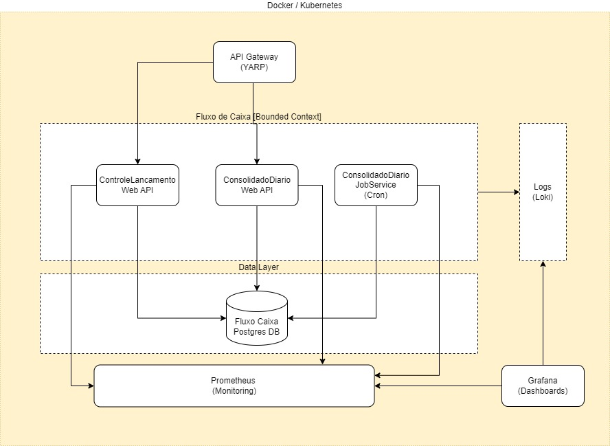

## Descritivo da Solução

A solucão da aplicação foi desenvolvida utilizando as seguintes tecnologias, maiores detalhes podem ser consultados no [documento de arquitetura](./SolucaoArquiteturaTecnica.md):

* .NET 9 - C# 13
* Entity Framework 9
* POSTGRESQL 14
* Docker e Docker Compose
* XUnit
* YARP

As portas para utilização das aplicações quando publicadas no Docker são: 

* API Gateway [5000] externa, interna 8080 (somente http).   
  

* ConsolidadoDiarioAPI [8000] externa, interna 8080 (somente http).  
  

* ControleLancamentoAPI [8100] externa, interna 8080 (somente http).

> As configurações podem ser consultadas no arquivo compose.yaml na pasta 'Solution Items' da solução.  
> 
> O POSTGRESQL ficou definido na porta padrão 5432 com usuario = root e password = secret  

## Executando a solução

    No Windows na pasta onde se encontra o arquivo compose.yaml, execute docker-compose.exe -f .\compose.yaml up -d

    ✔ Container dc-arquitetura-postgres-1                     Started               0.2s
    ✔ Container dc-arquitetura-consolidadodiarioservicejob-1  Started               0.4s
    ✔ Container dc-arquitetura-consolidadodiarioapi-1         Started               0.7s
    ✔ Container dc-arquitetura-controlelancamentoapi-1        Started               0.6s
    ✔ Container dc-arquitetura-gatewayapi-1                   Started               0.5s

    Depois execute docker-compose.exe ps, para verificar se os conteiners estão executando: 

    NAME                                     IMAGE                   COMMAND                  SERVICE                 CREATED         STATUS         PORTS
    dc-arquitetura-consolidadodiarioapi-1    consolidadodiarioapi    "dotnet ConsolidadoD…"   consolidadodiarioapi    9 minutes ago   Up 2 minutes   0.0.0.0:8000->8080/tcp
    dc-arquitetura-controlelancamentoapi-1   controlelancamentoapi   "dotnet ControleLanc…"   controlelancamentoapi   9 minutes ago   Up 2 minutes   0.0.0.0:8100->8080/tcp
    dc-arquitetura-gatewayapi-1              gatewayapi              "dotnet GatewayAPI.d…"   gatewayapi              9 minutes ago   Up 2 minutes   0.0.0.0:5000->8080/tcp
    dc-arquitetura-postgres-1                postgres:14-alpine      "docker-entrypoint.s…"   postgres                9 minutes ago   Up 2 minutes   0.0.0.0:5432->5432/tcp

    Obs.: Note que o conteiner do Job não estará executando, porque ele executa e termina, pode consultar o log deste conteiner: 

    docker logs dc-arquitetura-consolidadodiarioservicejob-1

    info: Program[0]
    Iniciando consolidado diário
    info: Program[0]
    Processando período entre: 03/13/2025 até 03/27/2025
    info: Program[0]
    Consolidado Diário: comercianteId = '12', data = '03/25/2025' - já estava processado
    info: Program[0]
    Consolidado Diário: comercianteId = '12', data = '03/26/2025' - já estava processado
    info: Program[0]
    Consolidados Processados: 0
    info: Program[0]
    Tempo de processamento: 00:00:01.23

    O serviço de Job poderá ser executado diversas vezes com o comando 
    docker start dc-arquitetura-consolidadodiarioservicejob-1

## Executando os testes unitários 

   Se estiver dentro do Visual Studio, Rider ou VS Code basta executar os testes unitários.

   Se for executar na linha de comando com o dotnet no terminal vá até a pasta de cada projeto de teste unitário onde está localizado o respectivo arquivo .csproj e execute o comando 
   dotnet teste .\ConsolidadoDiarioAPITests.csproj (exemplo)

    PS C:\projects\dotnet\dc-arquiteto\dc-arquitetura\ConsolidadoDiarioAPITests> dotnet test .\ConsolidadoDiarioAPITests.csproj
    Restore complete (1.0s)
    FluxoCaixaContext succeeded (0.7s) → C:\projects\dotnet\dc-arquiteto\dc-arquitetura\FluxoCaixaContext\bin\Debug\net9.0\FluxoCaixaContext.dll
    Common succeeded (2.5s) → C:\projects\dotnet\dc-arquiteto\dc-arquitetura\Common\bin\Debug\net9.0\Common.dll
    ConsolidadoDiarioAPI succeeded (2.6s) → C:\projects\dotnet\dc-arquiteto\dc-arquitetura\ConsolidadoDiarioAPI\bin\Debug\net9.0\ConsolidadoDiarioAPI.dll
    ConsolidadoDiarioAPITests succeeded (0.2s) → bin\Debug\net9.0\ConsolidadoDiarioAPITests.dll
    [xUnit.net 00:00:00.00] xUnit.net VSTest Adapter v2.8.2+699d445a1a (64-bit .NET 9.0.3)
    [xUnit.net 00:00:00.09]   Discovering: ConsolidadoDiarioAPITests
    [xUnit.net 00:00:00.16]   Discovered:  ConsolidadoDiarioAPITests
    [xUnit.net 00:00:00.17]   Starting:    ConsolidadoDiarioAPITests
    [xUnit.net 00:00:01.99]   Finished:    ConsolidadoDiarioAPITests
    ConsolidadoDiarioAPITests test succeeded (3.9s)
   
    Test summary: total: 13, failed: 0, succeeded: 13, skipped: 0, duration: 3.9s
    Build succeeded in 11.3s

## Executando o teste de integração 

Para executar o teste de integração será necessário ter o postresql configurado e as seguintes condições: 

    Pode ser definida uma variável de ambiente 'FLUXOCAIXA_CONNECTION_STRING' com a connection string para o servidor postgresql a ser utilizado.

    Caso queira subir um servidor postresql sem definir a variavel de ambiente basta olhar o arquivo compose.yaml que está definido na pasta 'Solution Items'.

    O Teste de integração criará um database no postgres automaticamente com o nome neste formato: ConsolidadoDiarioServiceJobTest-{DateTime.Now.ToString("yyyyMMddHHmmss") e no final do teste irá removê-lo automaticamente.  

    Serão criados 12 registros de lançamentos diários e a consolidação irá gerar 6 registros nas respectivas tabelas.

Se estiver dentro do Visual Studio, Rider ou VS Code basta executar o projeto de teste. 

Se for executar na linha de comando com o dotnet no terminal vá até a pasta do projeto 'ConsolidadoDiarioServiceJobTests' onde está localizado o respectivo arquivo .csproj e execute o comando
dotnet teste .\ConsolidadoDiarioServiceJobTests.csproj (exemplo)

Obs.: Caso não tenha configurado a variável de ambiente, mas tenha utilizado o postgresql conforme o compose.yaml, basta editar o arquivo hosts do windows e inserir um uma linha

      127.0.0.1 postgres

## Testar os endpoints das WebApis

    Para testar os endpoints das WebApis importe o template do postman com os endpoints já configurados no documento 'API Gateway - Fluxo Caixa.postman_collection.json' na pasta 'Documentos' da solução.
