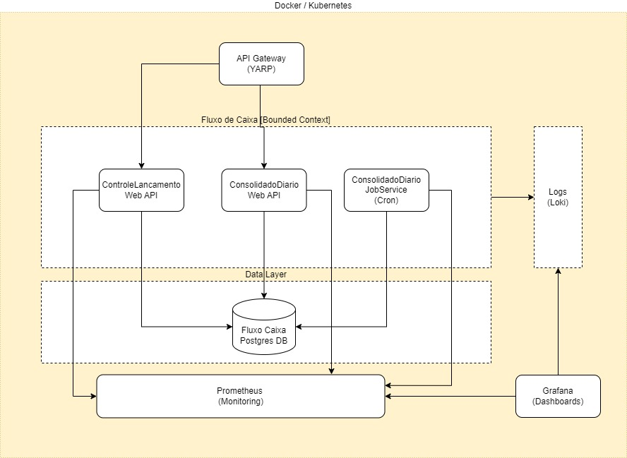

# Solução da Arquitetura Técnica

## Introdução

O desenho da solução foi desenvolvido de acordo com o [descritivo técnico](Descritivo-Tecnico.pdf) fornecido para o teste.  

Devido as condições de tempo, ausência de comunicação com membros da equipe, pois se trata de um teste, e o descritivo técnico por ser bem simples (o que é bom para um teste), tomei algumas decisões que vou detalhar a seguir:  

* Manter o design o mais simples possível para a solução.  
  

* Em cada item nos atributos de arquitetura registrei algumas decisões arquiteturais e comentários para explicar melhor o desenho do diagrama de arquitetura abaixo.  
    

* Considerei o domínio Fluxo de Caixa como um contexto (bounded context - termo utilizado no DDD para definir limites), então utilizei o conceito de um database para cada bounded context e a possibilidade de sempe iniciar com um monolito e depois com o tempo ir quebrando para microserviços se for o caso desse tipo de arquitetura, pois o contrário é mais complicado (consolidar microserviços em monolito).
  

* Pode ser um pouco estranho falar em monolito e ter duas WebAPIs no mesmo bounded context, mas tomei esta decisão devido a minha interpretação no descritivo técnico onde cita dois serviços e se um cair o outro deve continuar e ainda um têm um requisito não funcional de throughput.  
  
  
* Utilizei um API Gateway simples em .NET (YARP) e ser a porta de entrada para as aplicações clientes externas e também para empregar um output cache no serviço de consolidação diária no endpoint GET para otimizar o desempenho, definir um rate limit de 60 requests por segundo para o mesmo serviço conforme o requisito não funcional e possivelmente configurar um nível de segurança com OIDC / OAUTH.  
  
  
* O serviço para a consolidação diária dos lançamentos foi definido como um Job, projeto do tipo console, que pode ser executado a partir de qualquer critério através de CRON, não havendo necessidade de ficar executando no servidor sem operações gastando recursos.    
  

* Nos itens de cross cutting como Prometheus, Grafana e Loki foram colocados a nível de sugestão inicial para atender aos requisitos para observabilidade e resiliência da solução e porque são ótimas ferramentas utilizadas no mercado.  
  

* Por último, utilizei o database relacional, POSTGRES, e o Entity Framework 9 (.NET 9). Poderia adotar o Dapper, pois tem desempenho melhor, mas segundo alguns benchmarks o EF 9 têm significativas melhorias de perfomance e não fica muito longe do Dapper conforme [link](https://trailheadtechnology.com/ef-core-9-vs-dapper-performance-face-off/#:~:text=The%20measured%20difference%20was%20minimal,1.57x%20more%20memory%2Dintensive).    
Como não tinha informações sobre volume, carga e outras necessidades optei por database relacional pela facilidade em fazer consultas.
  
 

## Atributos de Arquitetura

### Escalibilidade

    * Para atender este atributo a solução foi desenhada para suportar containers. Com esse padrão é possível escalar horizontalmente as aplicações, balanceamento de carga e monitorá-las em plataformas como Docker, Kubernetes, Clouds etc.  

    * Inicialmente foi utilizado um simples output cache de saida no endpoint GET do serviço de consolidação diário no API Gateway como a forma mais simples e barata para começar.

### Resiliência

    * Para atender este atributo a solução foi desenhada para iniciar com containers, conforme citado ateriormente, e serviços de monitoramento, dashboards, alertas e logs. Para isso, produtos como: Prometheus, Grafana, Loki podem ser uma boa opção para iniciar e atender as definições e estratégias a serem definidas para auxiliar na recuperação de falhas.  
  
    * Pode ser facilmente substituída por qualquer ferramenta de mercado, pois se for utilizado o protocolo OTLP (Open Telemetry) a mudança é normalmente mais fácil.

### Segurança

    A segurança não foi implementada no código da solução, mas poderia definir da seguinte forma:  

    * Identity provider que suporte, OAuth / OIDC para autenticação e autorização.  

    * API Gateway - Recebe JWT OpenID das aplicações Web / Mobile, através de Authorization Code Flow com PKCE (OAuth).

    * API Gateway se comunica com WebApis através de Client Credentials (OAuth) obtida pelo Identity Provider. 

    * CORS definido nos WebApis para aceitar somente chamadas do API Gateway (opcional). 

    * Firewall de borda para evitar ataques DDOS. 

    * Criação de credenciais especifícas para utilização do banco de dados nas aplicações com o uso de secrets. 

    * Monitoramento e alertas de ameaças. 

### Padrões Arquiteturais

    O padrões arquiteturais utilizados inicial para a solução foram considerados com as premissas de simplicidade e o descritivo técnico simplificado: 

    * Monolito / Monolito Modular (N Layer)
    * HTTP APIs - Síncronas

    Obs.: Apesar de o termo REST ser comum quando utilizado em HTTP APIs tenho algumas considerações e sou cauteloso nesse uso, depois que li grande parte da dissertação do Roy Fielding sobre o tema.  

### Integração 

    * A integração entre os serviços poderá ser realizada através dos endpoints das APIs, mas isto deve ser bem pensando, pois se existirem muitas dependências entre os serviços pode indicar um bad design e ser necessário uma revisão.

### Testes Automatizados

    * Os testes unitários são sempre mais rápidos e preferenciais quando cobrem grande parte das funcionalidades com segurança e confiabilidade, então foram desenvolvidos para todas as features das Web APIs obtendo um Code Coverage de mais de 90%.

    * O Job ConsolidadoDiarioServiceJobTests, por se tratar de uma aplicação especifíca que necessita de dados foi utilizado um teste de integração utilizando o componente do banco de dados POSTGRES real. 
    
    * Nenhum teste de carga foi desenvolvido para validar o requisito não funcional de 50 requests por segundo. 
    Poderia ser utilizado ferramentas como JMeter, Bombardier, NBomber(.NET).

### Possíveis evoluções

    Por se tratar de um cenário simplificado para um teste através do descritivo técnico, considerei algumas possibilidades para possiveis evoluções arquiteturais:

    * Possibilidade de utilizar GRPC para os serviços com o suporte ao protocolo GRPC Gateway utilizando um API Gateway na borda para saída de HTTP API (Open API).  

    * Possibilidade que utilizar eventos para processamento assíncrono se fizer sentido e talvez evoluir para uma arquitetura EDA.  

    * Por se tratar de um contexto financeiro poderá ser útil com algum domínio utilizar EventSourcing para melhorar o nível de segurança, pois é a única fonte da verdade.

    * Possibilidade de utilizar o protocolo PASETO ou JOSE ao invés de JWT para o fluxo de autenticação e autorização, pois não têm as vulnerabilidades do JWT.

    * Utilizar Kubernetes ou Kubernetes gerenciado em CLoud ou similiar.

    * Utilizar banco de dados NoSQL. Pode ser muito útil para aplicar o CAP teorema no particionamento e distribuição de dados com volume alto.

    * Possibilidade de utilizar um API Gateway mais robusto, mas deve se atentar ao custo e complexidade.

    * Evoluir para microservices, mas para isto se deve pensar muitas vezes...rsrs

    * Utilizar uma serviço de trace distribuído, por exemplo, Jaeger.

### Comentários Finais

    O Extrato de Consolidação Diária poderá ser obtido através da composição das WebAPIs ControleLancamento e ConsolidadoDiario, onde cada uma faz a sua parte e uma aplicação pode efetuar esta tarefa ou um API Gateway mais robusto.  